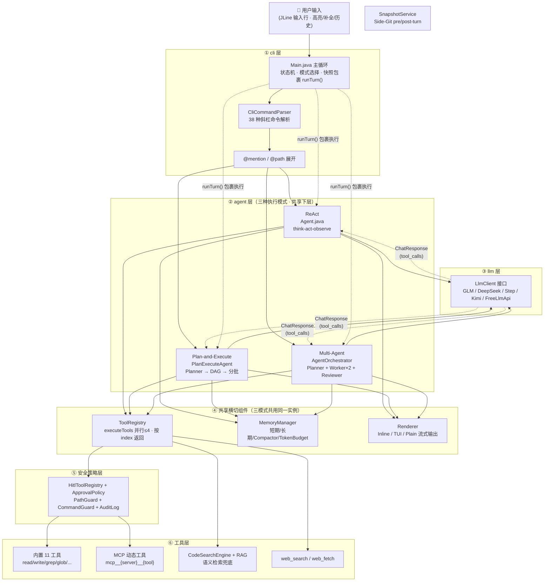
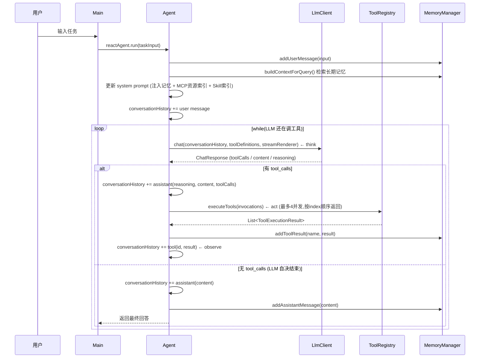
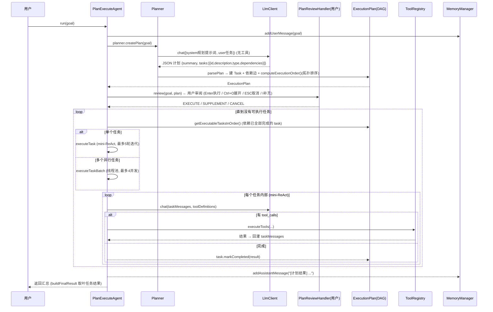
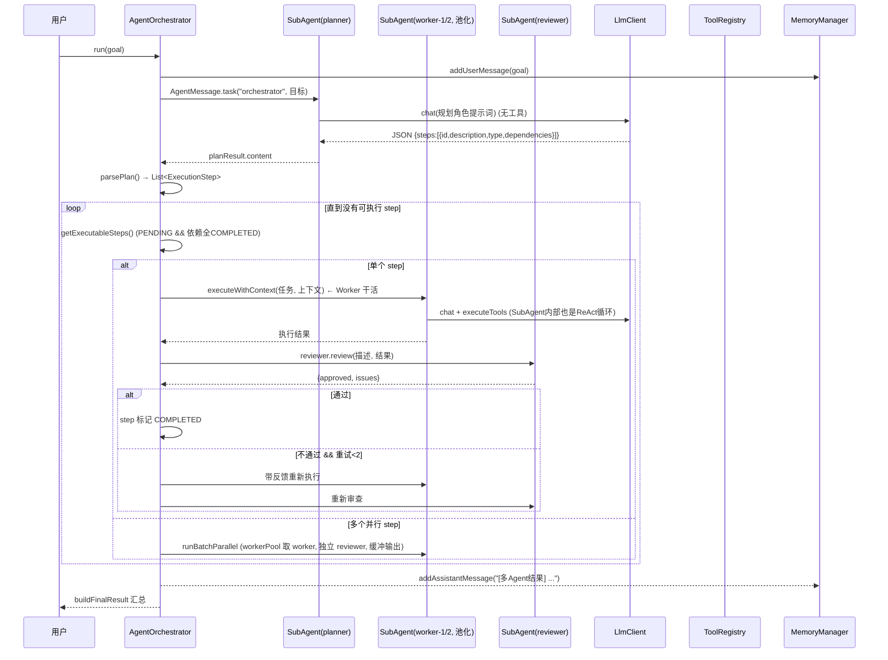

# PaiCLI 架构图 & 三种执行模式数据流转

> 本文件基于源码逐行梳理，目标：让你能**画出整体架构图**，并讲清楚**同一段用户输入在 ReAct / Plan-and-Execute / Multi-Agent 三种模式下各自怎么流转**。
>
> 关键代码位置：
> - 入口分发：`src/main/java/com/paicli/cli/Main.java`（主循环 4.x 阶段）
> - 命令解析：`src/main/java/com/paicli/cli/CliCommandParser.java`
> - ReAct：`src/main/java/com/paicli/agent/Agent.java`
> - Plan：`src/main/java/com/paicli/agent/PlanExecuteAgent.java` + `src/main/java/com/paicli/plan/Planner.java`
> - Multi-Agent：`src/main/java/com/paicli/agent/AgentOrchestrator.java` + `SubAgent.java`

---

## 一、整体架构图

### 1.1 分层架构

```
┌────────────────────────────────────────────────────────────────────────────┐
│                              终端用户 (Terminal)                             │
│   JLine 4 输入行 / HITL 确认 / ESC 取消 / Ctrl+O 折叠 / Ctrl+V 抓图          │
└───────────────────────────────┬────────────────────────────────────────────┘
                                │  readLine
                                ▼
┌────────────────────────────────────────────────────────────────────────────┐
│  cli 层   Main.java (主循环状态机)                                          │
│  ├── CliCommandParser.parse(input)  → 38 种斜杠命令 / NONE                  │
│  ├── @mention 展开 (MCP resource) + @path 本地引用展开                       │
│  └── 模式选择: nextTaskUsePlanMode → Plan / nextTaskUseTeamMode → Team /     │
│              否则 → ReAct；外层包 snapshotService.runTurn(...)                │
└───────────────┬────────────────────────────────────────────────────────────┘
                ▼
┌────────────────────────────────────────────────────────────────────────────┐
│  agent 层  三种执行模式 (共享 ToolRegistry / MemoryManager / SnapshotService) │
│                                                                             │
│   ┌───────────────┐   ┌──────────────────┐   ┌─────────────────────┐        │
│   │  ReAct         │   │  Plan-and-Execute│   │  Multi-Agent         │        │
│   │  Agent.java    │   │  PlanExecuteAgent│   │  AgentOrchestrator   │        │
│   │  think-act-    │   │  Planner(DAG)    │   │  Planner SubAgent    │        │
│   │  observe 循环   │   │  + 逐任务 mini-  │   │  + Worker×2 + Reviewer│       │
│   │                │   │  ReAct 循环      │   │  + 审查重试机制        │        │
│   └───────┬────────┘   └───────┬──────────┘   └───────────┬─────────┘        │
└───────────┼────────────────────┼───────────────────────────┼─────────────────┘
            ▼                    ▼                           ▼
┌────────────────────────────────────────────────────────────────────────────┐
│  tool 层   ToolRegistry  (三条路径都走 executeTools())                        │
│  ├── 内置 11 工具: read_file / write_file / list_dir / glob_files /          │
│  │   grep_code / execute_command / create_project / search_code /           │
│  │   web_search / web_fetch / revert_turn                                   │
│  ├── MCP 动态工具: mcp__{server}__{tool} (McpServerManager 启动后注入)        │
│  └── 并行执行: 最多 4 并发，结果按原始 index 顺序返回                         │
└───┬───────────────┬───────────────┬───────────────┬─────────────────────────┘
    ▼               ▼               ▼               ▼
┌──────────┐  ┌──────────┐  ┌──────────────┐  ┌───────────────┐
│  code/rag │  │   web/    │  │    mcp/      │  │    policy/     │
│ 检索工具    │  │ 搜索/抓取  │  │ 传输/协议/资源 │  │ PathGuard/      │
│ CodeSearch │  │ Search    │  │ stdio+http   │  │ CommandGuard/   │
│ Engine+RAG │  │ Provider  │  │ JSON-RPC     │  │ AuditLog       │
└──────────┘  └──────────┘  └──────────────┘  └───────────────┘
    ┌─────────────────────────────────────────────────────────────────────────┐
    │  llm 层  LlmClient 接口 (多模型适配)                                      │
    │  GLMClient / DeepSeekClient / StepClient / KimiClient / FreeLlmApiClient │
    │  由 LlmClientFactory 根据 API Key / 配置切换                              │
    └─────────────────────────────────────────────────────────────────────────┘
┌────────────────────────────────────────────────────────────────────────────┐
│  memory 层  MemoryManager                                                    │
│  ├── 短期记忆 ConversationMemory (addUserMessage / addAssistantMessage /     │
│  │   addToolResult；每轮对话注入、淘汰最旧)                                   │
│  ├── 长期记忆 LongTermMemory (JSON 文件持久化, project/global 作用域)          │
│  ├── ConversationHistoryCompactor (90% token 阈值 Map-Reduce 压缩)            │
│  └── TokenBudget (按模型窗口动态计算可用 token)                                │
└────────────────────────────────────────────────────────────────────────────┘
┌────────────────────────────────────────────────────────────────────────────┐
│  render 层  Renderer 接口 → InlineRenderer (默认) / LanternaRenderer /        │
│  PlainRenderer；状态栏 StatusInfo；HITL 提示；Markdown 表格/代码块渲染         │
└────────────────────────────────────────────────────────────────────────────┘
```

### 1.2 共享的横切组件（三种模式都用到）

| 组件 | 类 | 作用 | 三种模式如何共享 |
|------|-----|------|-----------------|
| 工具注册表 | `ToolRegistry` | 工具注册/查找/执行/Schema 管理 | **通过构造函数注入**：ReAct 的 `Agent` 把同一个 registry 传给 Plan / Orchestrator |
| 记忆管理 | `MemoryManager` | 短期+长期记忆、token 预算 | Main 里用 `reactAgent.getMemoryManager()` 传给另外两个模式 |
| 快照 | `SnapshotService` | Side-Git 快照（pre-turn / post-turn） | Main 里 `snapshotService.runTurn(snapshotMode, ...)` 包住三种模式 |
| HITL 审批 | `HitlToolRegistry` + `ApprovalPolicy` | 危险操作人工确认 | 拦截顺序：HitlToolRegistry → ToolRegistry → PathGuard/CommandGuard |
| 渲染 | `Renderer` | 输出流、状态栏、折叠块 | `renderer.stream()` 统一走一条 stdout 通道 |

> **关键理解**：三种模式的区别**只在"决策方式"**（怎么决定下一步调什么工具），工具执行、记忆读写、渲染输出都是同一套。

### 1.3 Mermaid 架构总图（GitHub / IDE / Typora 可渲染）

> ASCII 版看 1.1；本图是可渲染版本。箭头含义：实线 = 调用/数据流，虚线 = 结果/回传。



**读图要点**：
- 三种模式**共享** ④ 里的 ToolRegistry / MemoryManager / Renderer 实例（Main 创建 ReAct Agent 后，把 `getToolRegistry()` / `getMemoryManager()` 传给 Plan 和 Orchestrator）。
- 工具执行**必须先过 ⑤ HITL 审批**再落地到 ⑥ 的具体工具；用户无法批准策略层（PathGuard/CommandGuard）拒绝的请求。
- 快照（`SnapshotService.runTurn`）在 ① Main 层**包裹**三种模式，所以 `/restore N` 对任意模式都生效。

---

## 二、一段 message 的入口（三种模式的公共前奏）

无论走哪个模式，Main 主循环里都会先做这些（`Main.java` 4.x 阶段）：

```
用户输入:  "分析 src/main/java/com/paicli/agent 包，并把结果写入 docs/agent-architecture.md"
    │
    ▼
1. CliCommandParser.parse(input)
   → CommandType.NONE (不是斜杠命令，走 Agent)
   （如果是 "/plan xxx" / "/team xxx" → SWITCH_PLAN / SWITCH_TEAM，直接带 payload 进对应模式）
    │
    ▼
2. mentionExpander.expand(input)       → 展开 @server:protocol://path (MCP resource)
   localPathMentionExpander.expand     → 展开 @path (本地文件/目录内联为 <file> / <directory>)
    │
    ▼
3. 模式选择（if/else）:
   ├─ nextTaskUsePlanMode 或 command==SWITCH_PLAN → runTask = PlanExecuteAgent::run,  snapshotMode="plan"
   ├─ nextTaskUseTeamMode 或 command==SWITCH_TEAM → runTask = AgentOrchestrator::run, snapshotMode="team"
   └─ 否则                                              → runTask = reactAgent::run,       snapshotMode="react"
    │
    ▼
4. snapshotService.runTurn(snapshotMode, taskInput, runTask::call)
   → pre-turn 快照 → 执行对应模式 → post-turn 快照（支持 /restore N 回滚）
    │
    ▼
5. renderer.updateStatus(...) → 渲染结果 → 回到 while(true) 等下一行输入
```

> `/plan`、`/team` 的语义是"**下一条任务**模式标志"：执行完自动重置回 ReAct（`nextTaskUsePlanMode=false`）。

下面用同一个例子，分别走三种模式，画出完整数据流转。

---

## 三、模式 ① ReAct（默认模式）

**入口**：`Agent.java` 的 `run(String userInput)`。核心是 think-act-observe 循环。

### 3.1 流转图（Mermaid 时序）



### 3.2 代码级数据流转（对应 `Agent.run()` 关键行）

```
run(userInput)
│  memoryManager.addUserMessage(userInput)                        // L132 写入短期记忆
│  memoryContext = memoryManager.buildContextForQuery(...)        // L137 检索长期记忆
│  updateSystemPromptWithMemory(memoryContext)                    // L138 重写 system[0]
│  conversationHistory.add(ImageReferenceParser.userMessage(...)) // L142 用户消息入历史(带skill body)
│
└→ while(true)                                                   // L154
     ├─ maybeCompactHistory()                                     // L164 超90%阈值就压缩
     ├─ budget.check()                                            // L165 token/死循环/硬轮数兜底
     ├─ response = llmClient.chat(history, toolDefinitions, ...) // L183 ★ think
     │
     ├─ if response.hasToolCalls():                               // L199 ★ act
     │    ├─ conversationHistory += assistant(reasoning+content+toolCalls)  // L204
     │    ├─ executeToolCalls() → toolRegistry.executeTools(...)  // L216 ★ observe
     │    ├─ 结果: memoryManager.addToolResult + history += tool  // L218-219
     │    └─ continue  ← 回到循环顶部
     │
     └─ else:  // LLM 不再调工具 → 结束
          conversationHistory += assistant(content)               // L230
          memoryManager.addAssistantMessage(content)              // L233
          return formatUserFacingResponse(reasoning, answer)      // L252
```

### 3.3 具体示例轨迹

输入："分析 src/main/java/com/paicli/agent 包，并把结果写入 docs/agent-architecture.md"

```
迭代1  think  → LLM 决定: 先看看目录里有什么
       act   → glob_files {pattern: "src/main/java/com/paicli/agent/*.java"}
       observe→ 返回 [Agent.java, PlanExecuteAgent.java, SubAgent.java, AgentOrchestrator.java, AgentMessage.java, AgentBudget.java]
迭代2  think  → 需要逐个读文件了解结构
       act   → read_file ×4 (并行，按 index 顺序返回)
       observe→ 4 段文件内容回灌历史
迭代3  think  → 内容足够，但还需要确认 docs 目录是否存在
       act   → list_dir {path: "docs"}  → 存在
迭代4  think  → 组织分析结果
       act   → write_file {path: "docs/agent-architecture.md", content: "..."}
               ↑ write_file 是危险工具 → HitlToolRegistry 拦截 → 用户确认 ✓
       observe→ 写入成功
迭代5  think  → 完成，输出最终总结
       （不再有 tool_calls）→ 返回最终回答，循环结束
```

**要点**：每一步只有一次 LLM 调用 + 一次工具批执行，历史像滚雪球一样回灌，LLM 在下一轮基于全部观察继续决策。

---

## 四、模式 ② Plan-and-Execute（/plan）

**入口**：`PlanExecuteAgent.run()`。核心：**先规划成 DAG，再按依赖分批执行**，每个子任务又是一个 mini-ReAct 循环。

### 4.1 流转图（Mermaid 时序）



### 4.2 代码级数据流转

```
PlanExecuteAgent.run(userInput)                                // L219
│  memoryManager.addUserMessage(userInput)                     // L221
│  runWithPlan(goal)                                           // L227
│     planner.createPlan(goal)                                 // L247
│       ├─ isSimpleGoal(goal)? → createMinimalPlan(单任务)     // L45 (简单请求不调LLM)
│       └─ 否则 → llmClient.chat(规划提示词, user)             // L57 (无工具)
│               → parsePlan(goal, planJson)                    // L69
│                   ├─ 创建 Task (task_1..task_n, 类型映射)     // L86-96
│                   ├─ 建立 dependencies / dependents          // L99-115
│                   └─ plan.computeExecutionOrder() 拓扑排序    // L119
│  reviewAndExecutePlan(plan)                                  // L251
│  ├─ reviewHandler.review(goal, plan)  ← HITL 人工审阅         // L253
│  │    ├─ EXECUTE → executePlan()
│  │    ├─ CANCEL  → 取消
│  │    └─ SUPPLEMENT(feedback) → 重新 createPlan(goal+补充要求) // L268
│  └─ executePlan(plan)                                        // L272
│       ├─ while(可执行任务非空)                                 // L280
│       │   getExecutableTasksInOrder(plan)                    // L284 (依赖全完成)
│       │   executeTaskBatch(可执行任务)                        // L289
│       │       ├─ 单个 → 直接 executeTask (串行)               // L362
│       │       └─ 多个 → FixedThreadPool(min(n,4)) 并行        // L381
│       │           各任务 ByteArrayOutputStream 缓冲 → 按序flush
│       │   task.markCompleted / markFailed                     // L294-308
│       │   进度<0.5且失败 → planner.replan(...) → 重新审阅      // L312-315
│       ├─ buildFinalResult(plan)  ← 收集叶任务结果             // L330
│       └─ 返回 "✅ 计划执行完成！..."                          // L346
│  memoryManager.addAssistantMessage("[计划结果] "+result)      // L229
```

### 4.3 具体示例轨迹

同一输入 → Planner 让 LLM 输出如下 JSON：

```json
{
  "summary": "分析 agent 包并生成架构文档",
  "tasks": [
    {"id": "t1", "type": "FILE_READ",  "description": "读取 agent 包下所有源码", "dependencies": []},
    {"id": "t2", "type": "COMMAND",    "description": "创建 docs 目录",           "dependencies": []},
    {"id": "t3", "type": "FILE_WRITE", "description": "编写架构文档",             "dependencies": ["t1","t2"]},
    {"id": "t4", "type": "VERIFICATION","description": "校验文档存在且非空",       "dependencies": ["t3"]}
  ]
}
```

执行顺序（拓扑排序后）：

```
批次1   t1(读代码) 和 t2(建目录) 无依赖 → 并行执行 (2 个线程)
批次2   t3(写文档) 依赖 t1,t2 都完成 → 单独执行
批次3   t4(校验)   依赖 t3 → 单独执行
```

每个 task 内部又是一个 mini-ReAct：
- `t1` 内部：`glob_files` → `read_file` ×4 → 完成
- `t2` 内部：`execute_command {mkdir -p docs}` → 完成
- `t3` 内部：`write_file`（HITL 确认）→ 完成
- `t4` 内部：`read_file` 校验 → 分析 → 完成

**与 ReAct 的区别**：ReAct 是"走一步看一步"，LLM 现场决策；Plan 是"先拿出完整计划给用户审阅，再按 DAG 依赖批量推进"，子任务可并行，失败可局部重规划。

---

## 五、模式 ③ Multi-Agent（/team）

**入口**：`AgentOrchestrator.run()`。核心：**主从架构**——规划者(Planner)拆解 → 执行者(Worker×2)干活 → 检查者(Reviewer)验收，不通过就带反馈重试。

### 5.1 流转图（Mermaid 时序）



### 5.2 代码级数据流转

```
AgentOrchestrator.run(userInput)                                // L138
│  memoryManager.addUserMessage(userInput)                     // L140
│
│  ── 第一阶段：规划 ──
│  planner.execute(AgentMessage.task("orchestrator", 目标))     // L151  ← SubAgent(PLANNER)
│  planResult = 规划者输出(纯文本 JSON)                          // L159
│  steps = parsePlan(planResult.content())                      // L165
│       ├─ 剥离 ```json 围栏 → Jackson 解析                     // L224-229
│       ├─ 第一遍建 step (重编号 step_1..n)                      // L246
│       └─ 第二遍建 dependencies                                // L258
│
│  ── 第二阶段：执行 ──
│  while(true):                                                // L179
│    executable = getExecutableSteps(steps)                    // L183 (PENDING && 依赖全COMPLETED)
│    if executable.size()==1:                                  // L189
│        worker = workers.get(cursor % 2) 轮询取 worker          // L192
│        runStep(step, ..., worker, reviewer, context, out)     // L195
│            ├─ worker.executeWithContext(taskMsg, context)     // L493  ← Worker 干活(ReAct)
│            ├─ reviewer.review(description, result)            // L512  ← Reviewer 审查
│            ├─ parseReviewApproval(content)  → approved?       // L522
│            ├─ 通过 → step.withResult                          // L526
│            └─ 不通过 → while(retries < 2):                     // L535
│                 worker 带 issues 反馈重跑 → reviewer 再审       // L542-568
│    else:                                                      // L197 (真正并行)
│        runBatchParallel(executable, steps, retryCount)        // L201
│            ├─ FixedThreadPool(min(batch,2))                    // L413
│            ├─ BlockingQueue 池化 worker (防同 worker 并发占)    // L418
│            ├─ 每 step 独立 ByteArrayOutputStream 缓冲          // L425
│            └─ 全部完成后按 step_id 顺序 flush                  // L467
│
│  ── 收尾 ──
│  残留 PENDING step → 提示"因前置失败被跳过"                    // L207
│  finalResult = buildFinalResult(steps)                       // L213
│  memoryManager.addAssistantMessage("[多Agent结果] "+...)      // L214
```

### 5.3 具体示例轨迹

```
第一阶段·规划 (planner SubAgent)
  规划者 LLM 输出 JSON → parsePlan 得到 3 个 step：
    step_1 读取 agent 包源码      (无依赖)
    step_2 创建 docs 目录          (无依赖)
    step_3 编写架构文档并校验      (依赖 step_1, step_2)

第二阶段·执行
  批次1 (并行, 2 个 worker):
    worker-1 → step_1: glob_files + read_file ×4 → 结果A
    worker-2 → step_2: execute_command {mkdir -p docs} → 结果B
  批次2 (单步):
    worker-1 → step_3: write_file 写入文档
      ↓
    reviewer 审查 step_3 结果:
      结果:  "架构文档写好了，覆盖了 4 个类"
      审查:  approved=false, issues=["缺少 AgentMessage 的角色职责说明"]
      ↓ 未通过, 重试 1/2
    worker-1 带反馈重跑 step_3 → 补写 AgentMessage 说明
    reviewer 再审查 → approved=true ✓
    step_3 标记 COMPLETED

汇总: buildFinalResult → "✅ 多 Agent 协作任务完成！ [step_1]✅ ... "
```

**与 Plan 模式的区别**：Plan 是"一个 Agent + 用户审阅计划"；Multi-Agent 是"多个不同角色的 SubAgent"，关键差异是 **Reviewer 角色**——每个 worker 产出都要被独立审查，不过就带反馈重试（最多 2 次），失败次数过半还会提示。Worker 池大小为 2（`List.of(worker-1, worker-2)`），这是与 Plan 的 4 并发不同的地方。

---

## 六、三种模式对比速查

| 维度 | ReAct | Plan-and-Execute | Multi-Agent |
|------|-------|------------------|-------------|
| 触发 | 默认 | `/plan` 或 `/plan <任务>` | `/team` 或 `/team <任务>` |
| 入口类 | `Agent.run()` | `PlanExecuteAgent.run()` | `AgentOrchestrator.run()` |
| 决策方式 | LLM 现场 think-act-observe | 先 LLM 规划成 DAG，用户审阅后分批执行 | 规划者拆解 + 执行者干活 + 检查者验收 |
| 用户参与 | 仅在 HITL 危险工具时 | 计划审阅（Enter/Ctrl+O/ESC/I） | 仅在 HITL 时 |
| 子任务内部 | —（本身就是单循环） | mini-ReAct（≤5 轮迭代） | SubAgent 内部 ReAct |
| 并行上限 | 工具级：≤4 | 任务级：≤4 | 步骤级：≤2（worker 池大小） |
| 失败处理 | 无计划概念，靠 LLM 自愈 | 进度<50% 时 `planner.replan()` | Reviewer 驳回 → 带反馈重试 ≤2 |
| 上下文共享 | 单一 conversationHistory | 每个 task 独立 messages + 依赖结果拼接 | 每个 step 独立 context + 依赖结果拼接 |
| 最终汇总 | 直接返回最终轮回答 | `buildFinalResult` 取叶任务 | `buildFinalResult` 步骤状态总结 |
| 快照模式 | `snapshotMode="react"` | `"plan"` | `"team"` |

**记住一句话**：三种模式共享 `ToolRegistry`（工具）、`MemoryManager`（记忆）、`SnapshotService`（快照）、`Renderer`（渲染），区别只在"**由谁、按什么规则决定下一步做什么**"。

---

## 七、完整链路串一遍（以 ReAct 为例，含所有横切组件）

```
终端输入 → LineReader(高亮/补全/历史) → Main 主循环
  → CliCommandParser 解析 → 非斜杠命令
  → mention 展开 (@resource / @path)
  → snapshotService.runTurn("react", ...)          [Side-Git pre-turn 快照]
  → Agent.run(taskInput)
      → MemoryManager.addUserMessage                [短期记忆写入]
      → MemoryManager.buildContextForQuery          [长期记忆检索]
      → system prompt 装配: PromptAssembler(PromptMode.AGENT)
          = 角色 + 记忆上下文 + MCP资源索引 + Skill索引 + 工具说明
      → llmClient.chat(history, toolDefinitions)    [LlmClient 多模型适配]
      → 返回 tool_calls
      → ToolRegistry.executeTools(并行≤4, 按index排序)
          → 内置工具 / mcp__ 动态工具
          → HITL 拦截(危险工具) → ApprovalPolicy + PathGuard/CommandGuard + AuditLog
      → 结果回灌 conversationHistory + MemoryManager.addToolResult
      → 循环直到 LLM 自决结束
  → 最终回答 → Renderer.stream() 渲染 (InlineRenderer 流式 Markdown)
  → snapshotService 写 post-turn 快照
  → 回到 while(true) 等待下一条输入
```

---

## 附：本文件涉及的源码关键行（速查）

| 逻辑 | 文件:行 |
|------|---------|
| 模式分发 if/else | `cli/Main.java:757-779` |
| 快照包裹执行 | `cli/Main.java:782-784` |
| 命令解析 | `cli/CliCommandParser.java:56-290` |
| ReAct 主循环 | `agent/Agent.java:154-259` |
| ReAct 工具执行(并行) | `agent/Agent.java:625-644` |
| 记忆上下文注入 | `agent/Agent.java:136-144` |
| Planner 创建计划 | `plan/Planner.java:42-64` |
| 计划解析(DAG) | `plan/Planner.java:69-124` |
| Plan 任务执行 | `agent/PlanExecuteAgent.java:272-347` |
| Plan 并行批次 | `agent/PlanExecuteAgent.java:360-433` |
| Plan 单任务 mini-ReAct | `agent/PlanExecuteAgent.java:440-554` |
| 多Agent 规划+执行 | `agent/AgentOrchestrator.java:138-217` |
| 多Agent 审查重试 | `agent/AgentOrchestrator.java:481-578` |
| 多Agent 并行批次 | `agent/AgentOrchestrator.java:410-474` |
